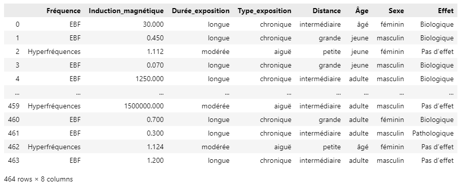

# Magnetic-Field-Exposure-Health-Effect-Prediction
This is a Machine Learning project that predicts the health effect of a given magnetic field exposure.

## Context
Moroccan preparatory classes for superior schools (CPGE) give students the opportunity to learn about the
world of scientific research through Supervised Personal Initiative Works (TIPE). Every year we specify a 
theme for them and let them show their creativity and their ability to adapt to the world changes. In this 
context (Theme 2022: Health-Prevention), based on a set of epidemiological studies, I built a database on 
the effect of exposure to magnetic fields. Then, I used artificial intelligence techniques, mainly machine 
learning principles, in order to be able to make predictions on the effect of any magnetic field exposure. 
However, since there will always be people who are not good at data science, I thought of creating a web 
application using Streamlit that will provide users with a clear and understandable interface allowing them 
to assess their own exposure simply, quickly and efficiently.

## Problem description
In an ever-changing world, the intensive use of wireless technologies is making electromagnetic waves 
permeate our environment. They are invisible, odourless and yet they are everywhere around us. They 
come from the WIFI, power lines, mobile phones, etc. But for some people they could represent a real 
danger. This is the case of several subjects who suffer from common symptoms such as: tingling, 
headaches, numbness, exhaustion... However, the real problem is that sometimes we do not know if these 
worries and suffering are really because of these waves.

## Suggested solution 
The subjects concerned can measure the electromagnetic fields around them and see if they meet international standards: those of the International Commission on Non-Ionizing Radiation Protection (ICNIRP) for example, consult their doctor and of course try my project even if it is not completely perfect since the database involved is not big enough.

## You Will see in this project

  
  
  
  

Concerning the web application, you will get something like :

  

